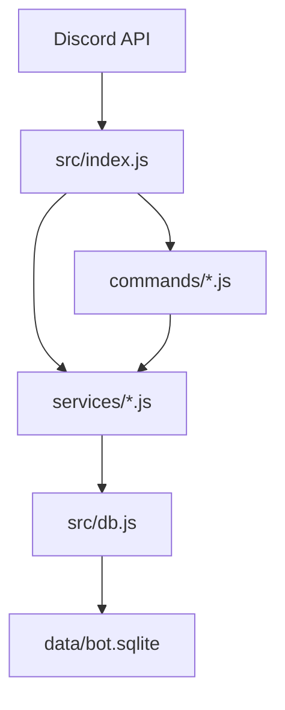

# Creator Challenge Bot (Discord) — MVP v0.2

A Discord bot purpose-built for content creators (YouTube, TikTok, Instagram, podcasts, newsletters) to run time-bound challenges, track submissions, award points, and show leaderboards — right inside a server channel.

---

## ✨ What you can do (MVP)

- `/create-challenge` — Post a challenge with title, description, and cadence (one-time, daily, weekly, monthly).
- `/list-challenges` — See active challenges.
- `/submit` — Submit text, a link, and/or an attachment (image/video) to a specific challenge.
- `/leaderboard` — See the top participants by points.
- Automatic 👍 and ❤️ reactions on each submission message so the community can vote.
- Points awarded for submissions (+1) and for each upvote (configurable in code).

> Roadmap (built-in scaffolding): Recurring challenge automation, badges via roles, series, prize picks, and web dashboard.

---

## 🧠 Creator-focused example challenges

- Hook Writing Sprint: write 3 hooks for a topic in 10 minutes.
- Editing Sprint: 15 min cut of raw footage into a tight montage.
- B‑roll Scavenger Hunt: capture 5 textures (glass, wood, skin, fabric, stone).
- Thumbnail Redesign: remake a thumbnail for yesterday’s upload.
- Caption A/B Test: write 2 captions; post both; report CTR.
- Pitch & Outreach: send 3 collab DMs; share the template.
- Talking Head Reps: record a 60‑sec take; aim for 1-breath sentences.
- Keyword/Topic Deep Dive: find 5 long-tails for your niche.
- CTA Crafting: write a single-sentence CTA variant.
- Voiceover Practice: rewrite a paragraph for clarity and record it.

---

## 🏗 Project Structure

```
creator-challenge-bot/
├─ .env.example
├─ package.json
├─ README.md
├─ data/                      # SQLite database lives here (created on first run)
├─ scripts/
│  └─ reset-db.js             # Danger: deletes & recreates schema
└─ src/
   ├─ config.js               # Loads env vars & config accessors
   ├─ db.js                   # Main SQLite setup, schema, and helpers (preferred)
   ├─ index.js                # Bot bootstrap, event wiring
   ├─ deploy-commands.js      # Registers slash commands
   ├─ database/
   │  └─ db.js                # Legacy DB file (can be removed in cleanup)
   ├─ services/
   │  ├─ challenges.js        # Challenge CRUD & queries
   │  └─ points.js            # Points/leaderboard
   └─ commands/               # Slash command handlers
      ├─ ping.js
      ├─ createChallenge.js
      ├─ listChallenges.js
      ├─ submit.js
      └─ leaderboard.js
```

---

## 🔐 Setup (one-time)

1. **Create a Discord application & bot**
   - Go to the [Discord Developer Portal](https://discord.com/developers/applications) → New Application.
   - Add a Bot; copy the Token.
   - Enable Privileged Gateway Intents:
     - SERVER MEMBERS INTENT (if you plan to award roles for badges later).
     - MESSAGE CONTENT INTENT is not required for this MVP.
   - Under OAuth2 → URL Generator, select scopes: `bot`, `applications.commands`.
   - Bot permissions (minimum for MVP): `Send Messages`, `Embed Links`, `Read Message History`, `Add Reactions`, `Use Slash Commands`. If you’ll auto‑assign roles for badges later, add `Manage Roles`.

2. **Invite the bot to your server using the generated URL.**

3. **Clone & install**
   ```bash
   git clone <your-repo-url> creator-challenge-bot
   cd creator-challenge-bot
   cp .env.example .env
   # Fill .env with DISCORDTOKEN, CLIENTID, and (during dev) GUILDID
   npm install
   ```

4. **Deploy slash commands (guild-scoped for instant updates during dev)**
   ```bash
   npm run deploy:commands
   ```

5. **Run the bot**
   ```bash
   npm run start
   ```

> Tip: If commands don’t show, make sure the bot is in the server referenced by `GUILDID`, re-run `deploy:commands`, or wait a few minutes for global registration (if you remove `GUILDID`).

---

## 🗂 Data Model

### Tables

- **challenges**
  - id (PK)
  - guild_id
  - title
  - description
  - type (one-time|daily|weekly|monthly)
  - created_by
  - starts_at
  - ends_at
  - channel_id
  - message_id
  - is_active

- **submissions**
  - id (PK)
  - challenge_id (FK)
  - guild_id
  - user_id
  - username
  - content_text
  - attachment_url
  - link_url
  - message_id
  - created_at
  - votes

- **points**
  - guild_id
  - user_id
  - points (composite PK)

### Points logic (MVP defaults)
- +1 point for submitting.
- +1 point per 👍 reaction on the submission embed (reaction events tracked).

---

## 🧩 How it fits together (dependencies & flow)

- `src/index.js` boots the Discord client, loads commands, and wires events including `interactionCreate` and `messageReactionAdd`.
- `src/deploy-commands.js` registers slash commands built in files under `src/commands/`. Each command exports `{ data, execute }` where `data` is a SlashCommandBuilder description and `execute` handles the interaction.
- `src/db.js` initializes SQLite (using better-sqlite3) and creates tables on first run.
- `src/services/challenges.js` offers DB helpers to create/list challenges and record submissions. It’s used by command handlers.
- `src/services/points.js` encapsulates points logic (increment on submission and reaction) and powers `/leaderboard`.
- `src/commands/*.js` are the user-facing command implementations.
- `scripts/reset-db.js` can wipe and recreate the schema (for testing).

---

## 🔗 ASCII Architecture Diagram

```
                ┌──────────────────┐
                │ Discord API       │
                │  (Gateway + REST) │
                └─────────┬────────┘
                          │
                 ┌────────▼────────┐
                 │ src/index.js    │  (bot entrypoint, event loop)
                 └───┬─────────┬───┘
                     │         │
        ┌────────────┘         └─────────────┐
        │                                    │
┌───────▼────────┐                  ┌────────▼────────┐
│ commands/*.js  │                  │ services/*.js   │
│ (SlashCmds)    │                  │ (logic layer)   │
└───────┬────────┘                  └────────┬────────┘
        │                                    │
        │                                    │
        │                           ┌────────▼────────┐
        │                           │ src/db.js       │
        │                           │ (SQLite schema) │
        │                           └────────┬────────┘
        │                                    │
        │                           ┌────────▼────────┐
        │                           │ data/bot.sqlite │
        │                           └─────────────────┘
```

---

## 🔗 Mermaid.js Architecture Diagram



---

## 🚦 Usage Examples

- **Create a daily challenge**  
  `/create-challenge title:"Hook Writing Sprint" description:"Write 3 hooks in 10 minutes" type:daily`

- **Submit with an image**  
  `/submit challengeid:1 text:"Day 1 hooks" attachment:<pick image>`

- **List active challenges**  
  `/list-challenges`

- **Show leaderboard**  
  `/leaderboard`

---

## 🧰 Configuration

Set these in `.env`:

- `DISCORDTOKEN` — your bot token (keep secret).
- `CLIENTID` — application ID (for command deployment).
- `GUILDID` — dev server ID for instant command deploys.
- `ANNOUNCECHANNELID` — (optional) default channel to post challenge embeds.
- `SUBMISSIONSCHANNELID` — (optional) where submission embeds are posted. If empty, the command’s channel is used.

---

## 🛡 Permissions Notes

- The bot must see and speak in the channels you use.
- For reaction-based voting, ensure the bot has `Add Reactions` and `Read Message History`.
- If you later enable role-based badges, add `Manage Roles`.

---

## 🐛 Troubleshooting

- **Slash commands not appearing**: double-check `CLIENTID`, `GUILDID`, and run `npm run deploy:commands`. Reinvite the bot if scopes/permissions changed.
- **Reactions not counted**: ensure the bot has `Add Reactions` and `Read Message History` and that partial structures are enabled (they are, in index.js). Reactions are only counted on bot-posted submission embeds.
- **Database locked**: avoid running multiple bot instances on the same SQLite file. For scale, switch to Postgres/Supabase.
- **Attachments failing**: Discord CDN links are saved; ensure the channel allows attachments.

---

## 🗺 Roadmap Ideas (next versions)

- Badge roles for milestones (5, 10, 25 submissions).
- Auto-schedule recurring challenge posts with node-cron.
- Admin-only prize selection flow with `/pick-winner`.
- Web dashboard for browsing submissions & analytics.
- Thread-per-challenge for cleaner discussions.
- Multi-guild config table; per-guild points weights.

---

## 📄 License

MIT — use freely and customize for your community.
