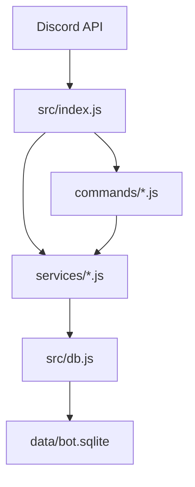

# Creator Challenge Bot (Discord) — MVP v0.2

A Discord bot purpose-built for content creators (YouTube, TikTok, Instagram, podcasts, newsletters) to run time-bound challenges, track submissions, award points, and show leaderboards — right inside a server channel.

---

## ✨ What you can do (MVP)

- `/create-challenge` — Post a challenge with title, description, and cadence (one-time, daily, weekly, monthly).
- `/list-challenges` — See active challenges.
- `/submit` — Submit text, a link, and/or an attachment (image/video) to a specific challenge.
- `/leaderboard` — See the top participants by points.
- Automatic 👍 and ❤️ reactions on each submission message so the community can vote.
- Points awarded for submissions (+1) and for each upvote (configurable in code).

> Roadmap (built-in scaffolding): Recurring challenge automation, badges via roles, series, prize picks, and web dashboard.

---

## 🧠 Creator-focused example challenges

- Hook Writing Sprint: write 3 hooks for a topic in 10 minutes.
- Editing Sprint: 15 min cut of raw footage into a tight montage.
- B‑roll Scavenger Hunt: capture 5 textures (glass, wood, skin, fabric, stone).
- Thumbnail Redesign: remake a thumbnail for yesterday’s upload.
- Caption A/B Test: write 2 captions; post both; report CTR.
- Pitch & Outreach: send 3 collab DMs; share the template.
- Talking Head Reps: record a 60‑sec take; aim for 1-breath sentences.
- Keyword/Topic Deep Dive: find 5 long-tails for your niche.
- CTA Crafting: write a single-sentence CTA variant.
- Voiceover Practice: rewrite a paragraph for clarity and record it.

---

## 🏗 Project Structure

```
creator-challenge-bot/
├─ .env.example
├─ package.json
├─ README.md
├─ data/                      # SQLite database lives here (created on first run)
├─ scripts/
│  └─ reset-db.js             # Danger: deletes & recreates schema
└─ src/
   ├─ config.js               # Loads env vars & config accessors
   ├─ db.js                   # Main SQLite setup, schema, and helpers (preferred)
   ├─ index.js                # Bot bootstrap, event wiring
   ├─ deploy-commands.js      # Registers slash commands
   ├─ database/
   │  └─ db.js                # Legacy DB file (can be removed in cleanup)
   ├─ services/
   │  ├─ challenges.js        # Challenge CRUD & queries
   │  └─ points.js            # Points/leaderboard
   └─ commands/               # Slash command handlers
      ├─ ping.js
      ├─ createChallenge.js
      ├─ listChallenges.js
      ├─ submit.js
      └─ leaderboard.js
```

---

## 🔗 ASCII Architecture Diagram

```
                ┌──────────────────┐
                │ Discord API       │
                │  (Gateway + REST) │
                └─────────┬────────┘
                          │
                 ┌────────▼────────┐
                 │ src/index.js    │  (bot entrypoint, event loop)
                 └───┬─────────┬───┘
                     │         │
        ┌────────────┘         └─────────────┐
        │                                    │
┌───────▼────────┐                  ┌────────▼────────┐
│ commands/*.js  │                  │ services/*.js   │
│ (SlashCmds)    │                  │ (logic layer)   │
└───────┬────────┘                  └────────┬────────┘
        │                                    │
        │                                    │
        │                           ┌────────▼────────┐
        │                           │ src/db.js       │
        │                           │ (SQLite schema) │
        │                           └────────┬────────┘
        │                                    │
        │                           ┌────────▼────────┐
        │                           │ data/bot.sqlite │
        │                           └─────────────────┘
```

---

## 🔗 Mermaid.js Architecture Diagram



---

## 🚦 Usage Examples

- **Create a daily challenge**  
  `/create-challenge title:"Hook Writing Sprint" description:"Write 3 hooks in 10 minutes" type:daily`

- **Submit with an image**  
  `/submit challengeid:1 text:"Day 1 hooks" attachment:<pick image>`

- **List active challenges**  
  `/list-challenges`

- **Show leaderboard**  
  `/leaderboard`

---

---

## 🛡 Permissions Notes

- The bot must see and speak in the channels you use.
- For reaction-based voting, ensure the bot has `Add Reactions` and `Read Message History`.
- If you later enable role-based badges, add `Manage Roles`.

---

## 🗺 Roadmap Ideas (next versions)

- Badge roles for milestones (5, 10, 25 submissions).
- Auto-schedule recurring challenge posts with node-cron.
- Admin-only prize selection flow with `/pick-winner`.
- Web dashboard for browsing submissions & analytics.
- Thread-per-challenge for cleaner discussions.
- Multi-guild config table; per-guild points weights.

---

## 📄 License

MIT — use freely and customize for your community.
